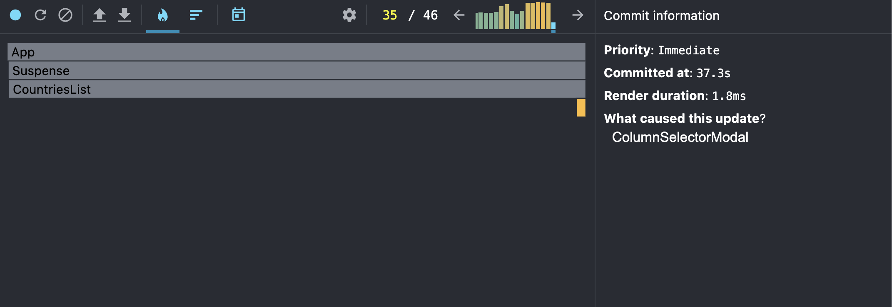
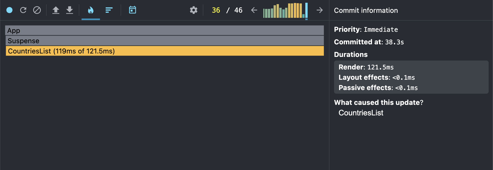
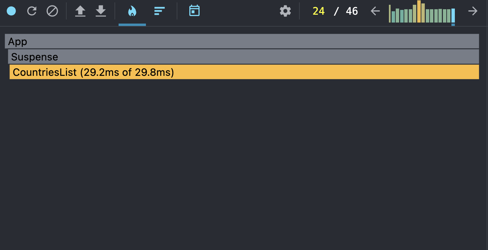
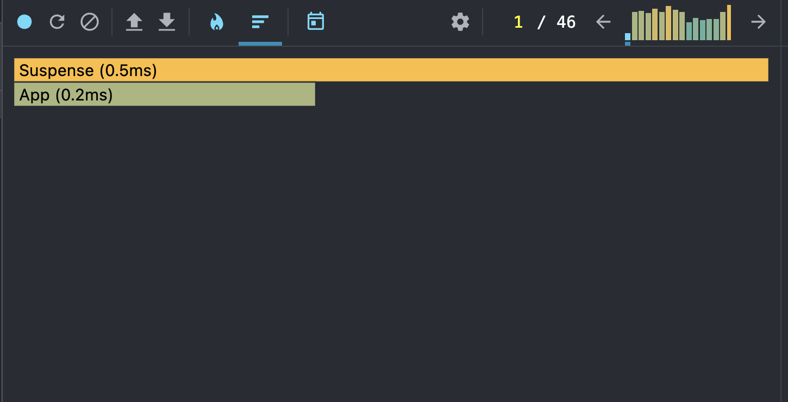
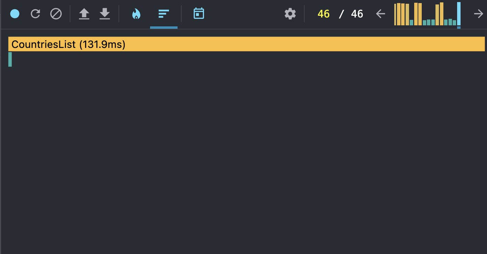

## Performance Profiling (initial)

### Actions tested
- Switching year
- Searching by country name
- Sorting by population
- Adding/removing extra columns

### Results
- **Commit duration**: ~23 ms
  
- **Render duration (top components)**:
  - CountriesList: ~121 ms
  
- **Interactions**: year change, search input, sort select
- **Flame Graph**:  
  

- **Ranked Chart**:  
  In start:
  
  
  In finish:
  

### Conclusion
The basic implementation works, but there are unnecessary redraws (for example, rerendering the entire table on any action).
Further we will optimize using `React.memo`, `useMemo`, `useCallback`.
