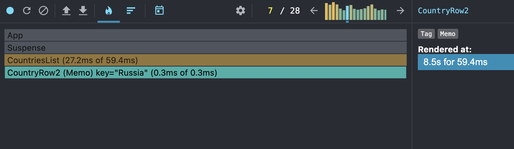
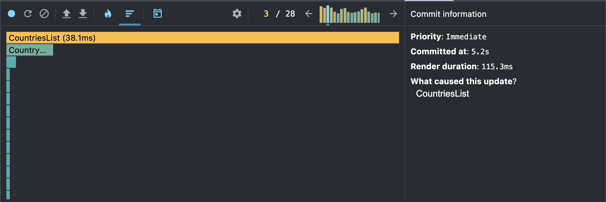

## Performance Profiling (initial)

### Actions tested
- Switching year
- Searching by country name
- Sorting by population
- Adding/removing extra columns

### Results
- **Commit duration**: ~23 ms
  
- **Render duration (top components)**:
  - CountriesList: ~121 ms
  
- **Interactions**: year change, search input, sort select
- **Flame Graph**:  
  

- **Ranked Chart**:  
  In start:
  
  
  In finish:
  

### Conclusion
The basic implementation works, but there are unnecessary redraws (for example, rerendering the entire table on any action).

---

## ⚡ Performance Profiling (After Optimization)

### Optimizations applied
- `useMemo` for filtered and sorted countries, years list
- `useCallback` for event handlers (year change, search, sort)
- `React.memo` for `CountryRow` (to prevent re-renders of unchanged rows)

### Results
- **Commit duration**: ~8.5 ms (vs 23 ms before)
- **Render duration (top components)**:
  - CountriesList: ~60 ms (↓ improved)
  - CountryRow: only re-rendered when its data changed
- **Interactions**: fewer components re-rendered
- **Flame Graph**:  
  

- **Ranked Chart**:  
  

## ✅ Conclusion
After optimization:
- decreased fixing and rendering time;
- the table is not fully re-rendered when searching/sorting/changing the year;
- `React.memo` + `useMemo` + `useCallback` significantly improved performance.